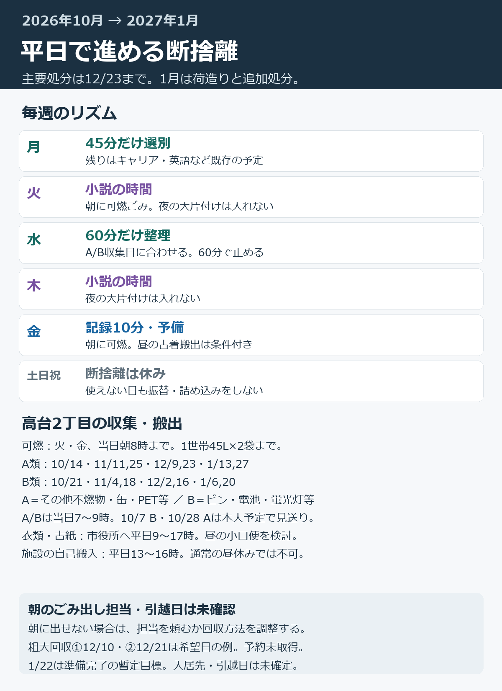
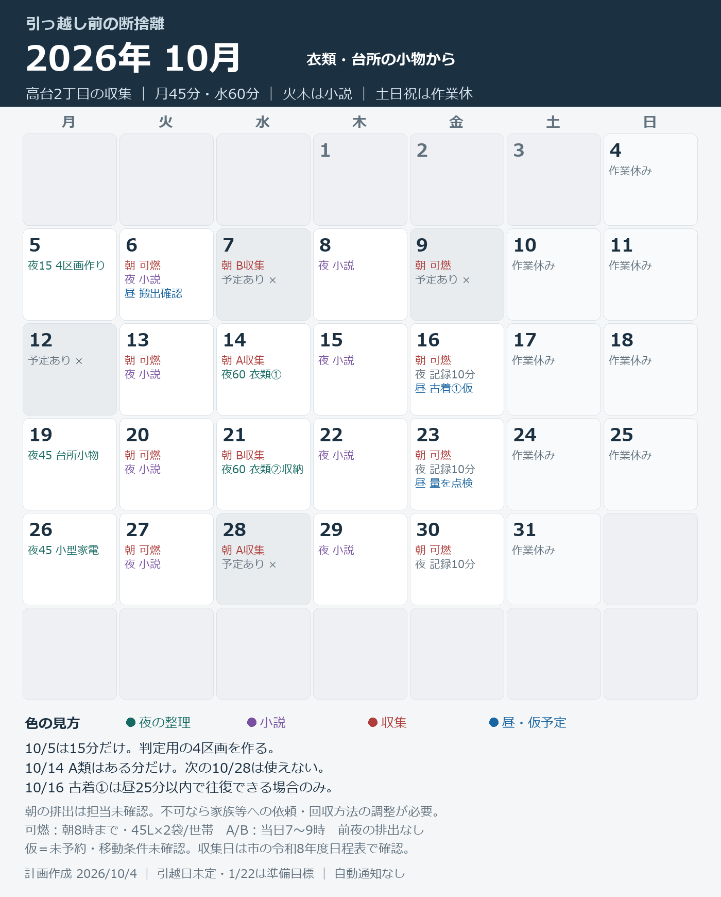
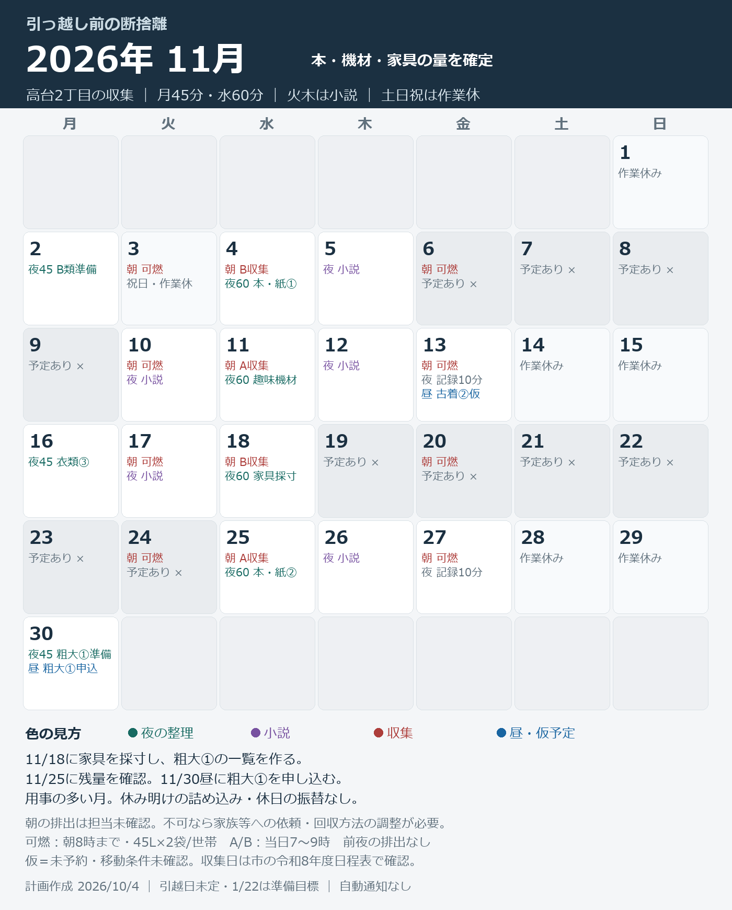
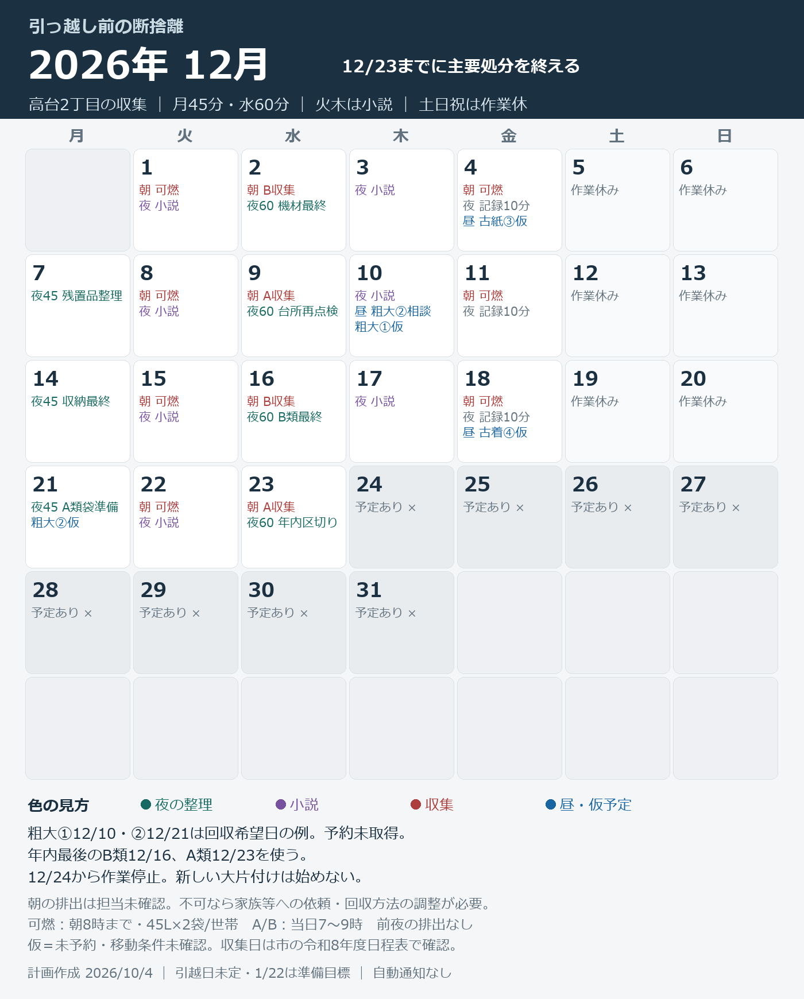
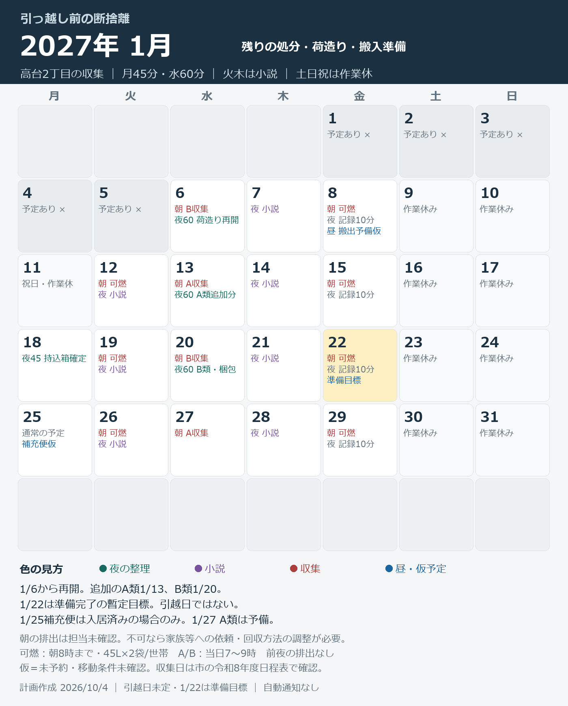

# 引っ越し前の断捨離・ごみ出しカレンダー

作成：2026-10-04 23:16:15（日本時間）。対象：2026年10月5日〜2027年1月31日。

**月曜45分・水曜60分を基本にして、火曜・木曜の小説時間と土日祝を残します。主要な断捨離・処分は12月23日までに終え、1月6日からは残りの処分と荷造りに移ります。** 12/24〜1/5は作業を入れません。

**確認待ちの前提：朝のごみ出しだけ3〜5分を確保できるかは未回答です。** 分別は定時後に行いますが、通常収集への排出は朝に必要です。下記は自分または家族等が当日朝に出せる場合の基本案で、担当未確定です。朝の排出ができない場合の分岐も後半に載せました。引越日は未定なので、**1/22は準備完了の暫定目標で、引越日の決定ではありません。**

## LINEで共有する

最初に概要画像1枚、その後に月別画像4枚をLINEに添付すると伝わりやすくなります。画像を開いて保存してから、LINEの写真添付で送れます。共有用には住所の番地を載せていません。

- [概要画像](../../house/moving_plan/line/00_plan_overview.png)
- [10月](../../house/moving_plan/line/2026-10_calendar.png)／[11月](../../house/moving_plan/line/2026-11_calendar.png)／[12月](../../house/moving_plan/line/2026-12_calendar.png)／[1月](../../house/moving_plan/line/2027-01_calendar.png)
- [LINE用のコピー文章](../../house/moving_plan/line/LINE_copy_text.txt)
- [画像5枚＋文章をまとめたZIP](../../house/moving_plan/line/declutter_calendar_LINE.zip)

## 週間の配分

既存の[曜日希望](../../taskManagement/master/schedule.md)にある火・木の小説、月・水・金のキャリア・英語を踏まえています。定時の時刻は不明なので、夜の開始時刻は固定せず、夕食・帰宅後の取りやすい時間に始めてください。

| 曜日 | 定時後 | ごみ・昼休み |
|---|---|---|
| 月 | 断捨離45分で終了。残りを既存のキャリア・英語へ。初回10/5だけ15分。 | 必要な予約・確認は昼11:30〜11:40。 |
| 火 | 小説の時間を確保。90分を目安に本人の生活に合わせる。大片付けは入れない。 | 可燃を朝に出す。前日の整理で袋を室内に準備。 |
| 水 | 断捨離60分。A/B回収後の次の仕分けを進める。 | 指定のA/B収集機会を使う。 |
| 木 | 小説の時間を確保。90分を目安に本人の生活に合わせる。 | 粗大の予約電話等が必要な日だけ昼10分。 |
| 金 | 袋数・箱数の記録10分まで。残りはキャリア・英語や休息。 | 朝は可燃。月に1〜2回、小口の古着・古紙搬出を昼に仮置き。 |
| 土日祝・用事の日 | 断捨離・搬出は予定しない。できなかった分は次の作業日に送る。 | カレンダーの「収集」は市の機会。休みや用事の日の本人排出は見送る。 |

年内の夜の選別枠は合計**16時間15分**。金曜記録と予約・小口搬出を含めると、概ね**18〜21時間**の計画です。一軒家を丸ごと空にする量を見積もった数字ではありません。10/23と11/25に実際の残量で見直します。

## 高台2丁目の収集日と出し方

高台1〜4丁目・高台西の行を、市の**令和8年度分別収集日程表**で確認しました。以下のA/Bの具体的な日付は公式表から転記しています。[日程表PDF](https://www.city.nagaokakyo.lg.jp/cmsfiles/contents/0000014/14052/R8nittei.pdf)

| 種別 | 使い方・時間 | 本人が使える年内の機会 |
|---|---|---|
| 可燃 | 火・金の当日朝8時まで。市指定袋、1世帯45L×2袋まで。普段の生活ごみを含む。 | 10/6,13,16,20,23,27,30、11/10,13,17,27、12/1,4,8,11,15,18,22の18回。 |
| A類 | その他不燃物、缶、PET、スプレー缶等。第2・4水曜、当日7〜9時。 | **10/14・11/11・11/25・12/9・12/23**。10/28は用事で見送り。 |
| B類 | ビン、乾電池・条件を満たす充電池、蛍光灯等。第1・3水曜、当日7〜9時。 | **10/21・11/4・11/18・12/2・12/16**。10/7は用事で見送り。 |
| プラ容器包装 | A/Bどちらの日も可。プラ製品全般が対象ではない。 | A/Bと同時。 |
| 古着・古紙 | 市役所分庁舎1の回収。平日9〜17時。古着は中身の見える袋、古紙は種類別にひもで束ねる。 | 昼の小口便を10/16・11/13・12/4・12/18、1/8予備に仮置き。 |
| 粗大ごみ | 1辺50cm以上は予約収集。品目別の有料。回収当日の指定時間までに指定場所へ。 | 第1便を11/30申込→12/10前後、第2便は必要時12/10相談→12/21までを希望。予約未取得。 |

可燃は生活ごみで1袋使うなら、断捨離の割当は**1袋/回＝年内18袋程度**が目安です。生活ごみで2袋埋まる日は断捨離分を次回へ送り、一時多量ごみは市へ相談します。前夜に外のステーションへ出す予定にはしていません。[可燃のルール](https://www.city.nagaokakyo.lg.jp/0000011246.html)

資源物の場所は可燃のステーションと異なる場合があるので、10/6に現在利用できる分別ステーションを確認します。年末年始の可燃の特別日程は12月の公式告知で確認するため、12/24〜1/5は本人の排出予定も置いていません。新居の地区へ移った後は新居の収集日を別に確認してください。この表は**高台2丁目の現住所用**です。[令和8年度しおりPDF](https://www.city.nagaokakyo.lg.jp/cmsfiles/contents/0000011/11246/R8shiori.pdf)

## 月別カレンダー

「夜45／夜60」＝定時後の作業分数。「朝A／朝B」＝市の収集機会。「仮」＝未予約または移動条件未確認。朝の排出担当が確保できることが前提です。色付き画像はLINE用、下の表は検索・修正用です。

### 2026年10月：衣類・台所の小物から

| 月 | 火 | 水 | 木 | 金 | 土 | 日 |
|---|---|---|---|---|---|---|
| — | — | — | 1 過去 | 2 過去 | 3 過去 | **4** 作業休み |
| **5** 夜15 4区画作り | **6** 朝 可燃 夜 小説 昼 搬出確認 | **7** 朝 B収集 予定あり × | **8** 夜 小説 | **9** 朝 可燃 予定あり × | **10** 作業休み | **11** 作業休み |
| **12** 予定あり × | **13** 朝 可燃 夜 小説 | **14** 朝 A収集 夜60 衣類① | **15** 夜 小説 | **16** 朝 可燃 夜 記録10分 昼 古着①仮 | **17** 作業休み | **18** 作業休み |
| **19** 夜45 台所小物 | **20** 朝 可燃 夜 小説 | **21** 朝 B収集 夜60 衣類②収納 | **22** 夜 小説 | **23** 朝 可燃 夜 記録10分 昼 量を点検 | **24** 作業休み | **25** 作業休み |
| **26** 夜45 小型家電 | **27** 朝 可燃 夜 小説 | **28** 朝 A収集 予定あり × | **29** 夜 小説 | **30** 朝 可燃 夜 記録10分 | **31** 作業休み | — |

### 2026年11月：本・機材・家具の量を確定

| 月 | 火 | 水 | 木 | 金 | 土 | 日 |
|---|---|---|---|---|---|---|
| — | — | — | — | — | — | **1** 作業休み |
| **2** 夜45 B類準備 | **3** 朝 可燃 祝日・作業休 | **4** 朝 B収集 夜60 本・紙① | **5** 夜 小説 | **6** 朝 可燃 予定あり × | **7** 予定あり × | **8** 予定あり × |
| **9** 予定あり × | **10** 朝 可燃 夜 小説 | **11** 朝 A収集 夜60 趣味機材 | **12** 夜 小説 | **13** 朝 可燃 夜 記録10分 昼 古着②仮 | **14** 作業休み | **15** 作業休み |
| **16** 夜45 衣類③ | **17** 朝 可燃 夜 小説 | **18** 朝 B収集 夜60 家具採寸 | **19** 予定あり × | **20** 朝 可燃 予定あり × | **21** 予定あり × | **22** 予定あり × |
| **23** 予定あり × | **24** 朝 可燃 予定あり × | **25** 朝 A収集 夜60 本・紙② | **26** 夜 小説 | **27** 朝 可燃 夜 記録10分 | **28** 作業休み | **29** 作業休み |
| **30** 夜45 粗大①準備 昼 粗大①申込 | — | — | — | — | — | — |

### 2026年12月：12/23までに主要処分を終える

| 月 | 火 | 水 | 木 | 金 | 土 | 日 |
|---|---|---|---|---|---|---|
| — | **1** 朝 可燃 夜 小説 | **2** 朝 B収集 夜60 機材最終 | **3** 夜 小説 | **4** 朝 可燃 夜 記録10分 昼 古紙③仮 | **5** 作業休み | **6** 作業休み |
| **7** 夜45 残置品整理 | **8** 朝 可燃 夜 小説 | **9** 朝 A収集 夜60 台所再点検 | **10** 夜 小説 昼 粗大②相談 粗大①仮 | **11** 朝 可燃 夜 記録10分 | **12** 作業休み | **13** 作業休み |
| **14** 夜45 収納最終 | **15** 朝 可燃 夜 小説 | **16** 朝 B収集 夜60 B類最終 | **17** 夜 小説 | **18** 朝 可燃 夜 記録10分 昼 古着④仮 | **19** 作業休み | **20** 作業休み |
| **21** 夜45 A類袋準備 粗大②仮 | **22** 朝 可燃 夜 小説 | **23** 朝 A収集 夜60 年内区切り | **24** 予定あり × | **25** 予定あり × | **26** 予定あり × | **27** 予定あり × |
| **28** 予定あり × | **29** 予定あり × | **30** 予定あり × | **31** 予定あり × | — | — | — |

### 2027年1月：残りの処分・荷造り・搬入準備

| 月 | 火 | 水 | 木 | 金 | 土 | 日 |
|---|---|---|---|---|---|---|
| — | — | — | — | **1** 予定あり × | **2** 予定あり × | **3** 予定あり × |
| **4** 予定あり × | **5** 予定あり × | **6** 朝 B収集 夜60 荷造り再開 | **7** 夜 小説 | **8** 朝 可燃 夜 記録10分 昼 搬出予備仮 | **9** 作業休み | **10** 作業休み |
| **11** 祝日・作業休 | **12** 朝 可燃 夜 小説 | **13** 朝 A収集 夜60 A類追加分 | **14** 夜 小説 | **15** 朝 可燃 夜 記録10分 | **16** 作業休み | **17** 作業休み |
| **18** 夜45 持込箱確定 | **19** 朝 可燃 夜 小説 | **20** 朝 B収集 夜60 B類・梱包 | **21** 夜 小説 | **22** 朝 可燃 夜 記録10分 準備目標 | **23** 作業休み | **24** 作業休み |
| **25** 通常の予定 補充便仮 | **26** 朝 可燃 夜 小説 | **27** 朝 A収集 | **28** 夜 小説 | **29** 朝 可燃 夜 記録10分 | **30** 作業休み | **31** 作業休み |

## 作業日の具体的な内容

| 日付 | 夜の上限 | やること |
|---|---:|---|
| 10/5（月） | 15分 | **4区画作り**：「新居へ／旧居保管／手放す／保留」の4区画を作る。衣類の引き出し1つだけ判定し、袋・箱の記録を始める。 |
| 10/14（水） | 60分 | **衣類①**：普段着・夏物・サイズ違いを選別。回収可能な古着、可燃、残す服を分ける。冬服は使用分を残す。 |
| 10/19（月） | 45分 | **台所小物**：不要な食器・鍋・金属小物を選別。50cm以上と電池入りは別置き。持込予定の家電は廃棄しない。 |
| 10/21（水） | 60分 | **衣類②収納**：衣類の2回目と収納1か所。A類は10/28が使えないので、次の11/11向けに室内保管する。 |
| 10/26（月） | 45分 | **小型家電**：使っていない小型家電・ケーブル・電池を判定。充電池を含む製品は市の専用ルールで別扱いにする。 |
| 11/2（月） | 45分 | **B類準備**：11/4向けにビン・乾電池・蛍光灯等を整理。電池入り製品の処分方法も確認する。 |
| 11/4（水） | 60分 | **本・紙①**：本・書類・雑誌の1回目。必要な本と不要な古紙を分け、搬出用に小束を作る。 |
| 11/11（水） | 60分 | **趣味機材**：魚突き・昆虫採集・標本機材の棚卸し。新居持込と旧居保管を決め、不要と判断した物だけ処分に回す。 |
| 11/16（月） | 45分 | **衣類③**：衣類の最終選別と押入れ1区画。保留服のうち、引っ越し後も使う物を決める。 |
| 11/18（水） | 60分 | **家具採寸**：本人が使う家具を採寸・撮影。不要家具の品名・数量・最大寸法を確定し、粗大ごみ①の一覧を作る。 |
| 11/25（水） | 60分 | **本・紙②**：11月の残りを片付け、古紙をまとめる。処分予定量と使える収集回数を比較する。 |
| 11/30（月） | 45分 | **粗大①準備**：粗大ごみ①の搬出動線・料金・回収場所を整理。予約が取れたら回収日当日に出せる形に準備する。 |
| 12/2（水） | 60分 | **機材最終**：趣味機材・ケーブル等の残りを整理。持ち込む長物・標本箱・PC関係を箱数で記録する。 |
| 12/7（月） | 45分 | **残置品整理**：旧居に残す消耗品を種類別にまとめ、「取りに来る箱」を作る。新居に運ぶ分を増やしすぎない。 |
| 12/9（水） | 60分 | **台所再点検**：台所・不燃小物の2回目。粗大ごみ②が必要なら品目を確定し、次の予約相談につなげる。 |
| 12/14（月） | 45分 | **収納最終**：押入れ・棚・机まわりの残りを判定。まだ処分するか迷う物は保留1箱に収め、12/21までに判断する。 |
| 12/16（水） | 60分 | **B類最終**：年内最後のB類排出後、電池・蛍光灯・ビン等の見落としを確認。追加分は1/6用に分別保管する。 |
| 12/21（月） | 45分 | **A類袋準備**：12/23のA類用に最後の不燃小物をまとめる。保留箱を再判定し、12/22の可燃も準備する。 |
| 12/23（水） | 60分 | **年内区切り**：主要な断捨離・処分の完了確認。持込品の箱数、旧居保管リスト、1月に残す作業を記録して終了する。 |
| 1/6（水） | 60分 | **荷造り再開**：B類の追加分を出し、衣類・機材の荷造りを再開。入居日・搬入経路・大型家電運搬方法を確認する。 |
| 1/13（水） | 60分 | **A類追加分**：A類の追加分を処分。PC・標本・長物の梱包を進め、搬入口と家具寸法を照合する。 |
| 1/18（月） | 45分 | **持込箱確定**：新居へ運ぶ箱数と大物を確定。原付の小口便と車・業者の大物便を分け、消耗品は旧居に残す。 |
| 1/20（水） | 60分 | **B類・梱包**：B類の追加分を出し、使用中の物以外を梱包。家電の水抜き・設置作業は引越日が決まってから別途設定する。 |

1回で触るのは引き出し1つ、棚1段など小区画に限ります。終了10分前から袋・箱を閉じ、床と通路を戻して終了。途中でも時間上限で止め、休みの日へ振り替えません。

## 古着・古紙を昼休みに出せるか

市役所分庁舎1は平日9〜17時なので、受付時間としては昼休みに合います。ただし現在の勤務地が不明で、45分の昼休みに往復できるかは未確認です。**搬出・移動を11:30〜11:55の25分以内に収め、食事に20分残せる場合だけ**実行します。自宅へ戻って積む往復まで詰め込まず、前日までに持ち運べる小口を用意し、安全に運べる量だけを原付で運びます。[古紙・古着の公式案内](https://www.city.nagaokakyo.lg.jp/0000003961.html)

4回に分けるのは予定を確保するためで、荷物を測る前に往復数を決めたわけではありません。袋が多く原付に載らない、勤務地から遠い、雨で古紙・古着が濡れる場合は搬出を中止して次便へ。12/4までに減らせていなければ、市へ近隣の集団回収や別の搬出方法を相談し、昼休みの過密な往復で解決しない計画です。

古着回収には下着・靴下、汚れた物、ダウン、布団、毛布、カッパ等を混ぜません。回収できない衣類は市の品目ルールに従って可燃・粗大等へ分けます。

## まとめて捨てる場合と、レンタカーの判断

**基本案は通常収集＋市の粗大ごみ予約回収です。ごみ処分のためのレンタカーは、まだ借りません。** 10/23に袋数、11/18に粗大の品目・数量、11/25に残量を見てから決めます。粗大①②は希望日の例で、回収日・時刻は予約結果に合わせて変更します。

市の粗大ごみは通常、申込後1週間〜10日前後、繁忙期はそれ以上かかります。電話は平日9〜12時・13〜17時なので11:30〜11:40を使えます。市公式LINEからの申込も可能です。搬出は家の中までは行われないため、大物を自分で運べない場合は搬出の手伝い・サービスを別途手配します。[粗大ごみの公式案内](https://www.city.nagaokakyo.lg.jp/0000001497.html)

**クリーンプラザおとくにへの自己搬入は平日13〜16時です。11:30〜12:15の昼休みには入れられず、定時後も16時を過ぎるなら使えません。** 市環境業務課（075-955-9689）への事前連絡が必要です。複数往復する場合は予定回数・種別・車両番号も事前に相談します。市町外のごみを持ち込む案ではありません。[持込窓口](https://cleanplaza-otokuni.jp/gomi/gomi/gomi.htm)／[2026年7月改訂の受入基準PDF・4ページ](https://cleanplaza-otokuni.jp/gomi/gomi/ukeire/ukeire.pdf#page=7)

| 実際に判明した量・制約 | 選ぶ方法 |
|---|---|
| 可燃は通常枠で減り、A/Bも次の回収まで保管できる | 現行の18回＋A/B各5回で少しずつ排出。車は不要。 |
| 粗大が数点で当日搬出できる | 市の予約回収。回収場所まで動かす手伝いの必要性を確認。 |
| 通常枠に収まらない袋・粗大が残るが、平日午後に時間を取れる | 市へ事前相談し、13〜16時に自己搬入。レンタカーは品目寸法・重量・荷室を確定してから。 |
| 平日午後も朝の搬出も確保できない | 市に、本人の利用できる時間で対応可能な一般廃棄物の許可業者等を相談。料金・時間は見積もり前なので未確定。 |

自己搬入の処理手数料は**1回100kg以下1,500円**。100kg超〜300kgは超過10kgごとに200円が加算されます。レンタカー・燃料・搬出作業の費用は別です。[公式料金表PDF](https://cleanplaza-otokuni.jp/gomi/gomi/ryoukin/ryoukin.pdf)

| 自己搬入の比較例 | 処理手数料だけ |
|---|---:|
| 1回100kg | 1,500円 |
| 1回200kg | 3,500円 |
| 2回、各100kg | 合計3,000円 |
| 3回、各70kg | 合計4,500円 |

このため「一気に1往復が常に最安」とは限りません。**総額＝処理手数料＋車両代＋燃料＋確保する作業時間**で比べます。往復数は、車の有効な積載容量・重量制限・実際の荷物で決めます。車を使う追加案は利用可能時間の変更が必要なため、基本カレンダーへ確定作業として入れていません。

## 朝のごみ出しができない場合

昼や定時後に通常ステーションへ出す置き換えはできません。袋は室内または自宅敷地内の保管場所にまとめ、当日朝に出す担当を家族等へ頼めるか確認します。A/Bも前夜にステーションへ置きません。粗大は予約時間に合う当日搬出が必要です。

担当を頼めない場合は、分別作業の月・水枠はそのまま使い、**10/6昼に市へ相談する作業を優先**します。平日午後の自己搬入時間を別途確保するか、本人の利用可能時間に対応する回収方法を確認します。朝の排出が成立しないまま「毎週捨てられる」とは見積もりません。

## 新居へ運ぶ物と、旧居に残す物

長岡中央第一ビル（前回掲載53.7㎡・2DK）とカサブランカ（前回掲載36.45㎡・2DK）をモデルにして、**小さい方へ置ける持込量**を先に作ると、どちらを選んでも荷物を調整しやすくなります。畳数や部屋形状、シンク・食洗機給水、大型家電の置場・搬入経路は未確認なので、面積だけで配置を保証しません。[前回の物件リンク集](../2026-10-03/claude_19-05-38_murata_housing_links.md)

| 区画 | 今回の扱い |
|---|---|
| 新居へ | 日常の衣類・寝具・PC、持込予定家電、必要な機材を優先。箱数と大物寸法を11/18〜1/18に確定。 |
| 旧居保管 | 消耗品の在庫、すぐ使わない残す機材等。種類と置場を書き、消耗品を取りに来る箱を作る。旧居を全面退去する前提ではない。 |
| 手放す | 本人が不要と判断した物のみ。衣類・可燃・A・B・古紙・粗大・特別処理に分ける。 |
| 保留 | 1箱まで。12/21に再判定。共有物や処分可否を決められない物は勝手に廃棄対象にしない。 |

持込予定の食洗機・乾燥機・洗濯機・冷蔵庫・ワインセラー・PCを不要家電扱いにはしていません。冷蔵庫・洗濯機・衣類乾燥機等を手放すことになった場合は、通常の粗大ごみとは別のリサイクル手続を確認します。

入居後の消耗品の補充は、**第2・第4月曜の帰宅時に20分以内で寄る**ことを暫定の習慣にします。1/25は入居済みの場合だけの最初の例です。空の物を買い足す前に旧居の在庫表を確認し、原付に安全に積める小口で持ち帰ります。

## 残量を見て計画を変える基準

| 確認日 | 数えるもの | 判断 |
|---|---|---|
| 10/23昼 | 捨てる可燃袋、A類の箱、衣類袋、未着手の収納区画 | 1区画の実測時間×残区画が残りの月水枠を超えるなら、小区画に絞るか追加の搬出支援を検討。休日へ自動振替しない。 |
| 11/18夜 | 粗大品名・数量・最大寸法、搬出の人手 | 11/30の予約申込に必要な情報を確定。売却・譲渡は期限内に決まらなければ処分方法を選び直す。 |
| 11/25夜 | 年内残る可燃袋、A/B、古着・古紙、粗大 | 可燃の残り8回（11/27〜12/22）で処理できるか確認。生活ごみ分を引いた上で不足なら市へ多量ごみ相談。 |
| 12/9夜 | 粗大②と最後のA/Bの残量 | 回収②は必要な時だけ。12/23を越えそうなら1/13のA類等へ送り、入居日と照合。 |
| 1/6夜 | 実際の入居日と残り荷物 | 1/22の暫定目標を入居日に合わせて変更。入居が早ければ1/6〜8に小口荷造りを先行し、旧居保管を活用。 |

袋・箱の記録は「日付／品目／新居箱数／旧居保管箱数／処分袋数／次の搬出先」の1行だけで十分です。手放す物の量がまだ分からないため、処分完了・車の往復数・実際の引越日を確定した記録にはしていません。

## 今すぐ始める最初の1手

**10/5（月）の定時後に15分だけ、4区画を作って衣類の引き出し1つを判定する。** 朝のごみ出し担当は別途確認し、判定した量を1行記録します。

指定の用事日と土日祝には作業を入れていません。祝日は[内閣府の2026・2027年表](https://www8.cao.go.jp/chosei/shukujitsu/gaiyou.html)で確認しました。LINE送信、粗大予約、車の予約、自動通知設定は実行していません。

[タスク正本](../../taskManagement/tasks/moving-declutter.md)／[計画の保存データ](../../house/moving_plan/plan_2026-10-04.json)
